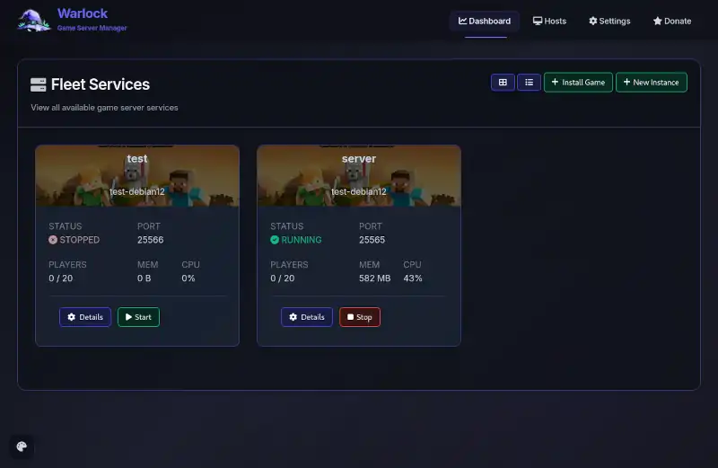
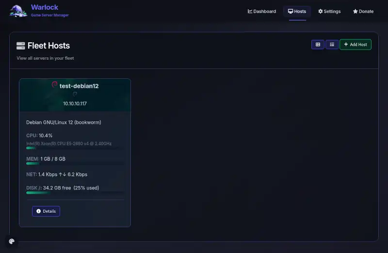
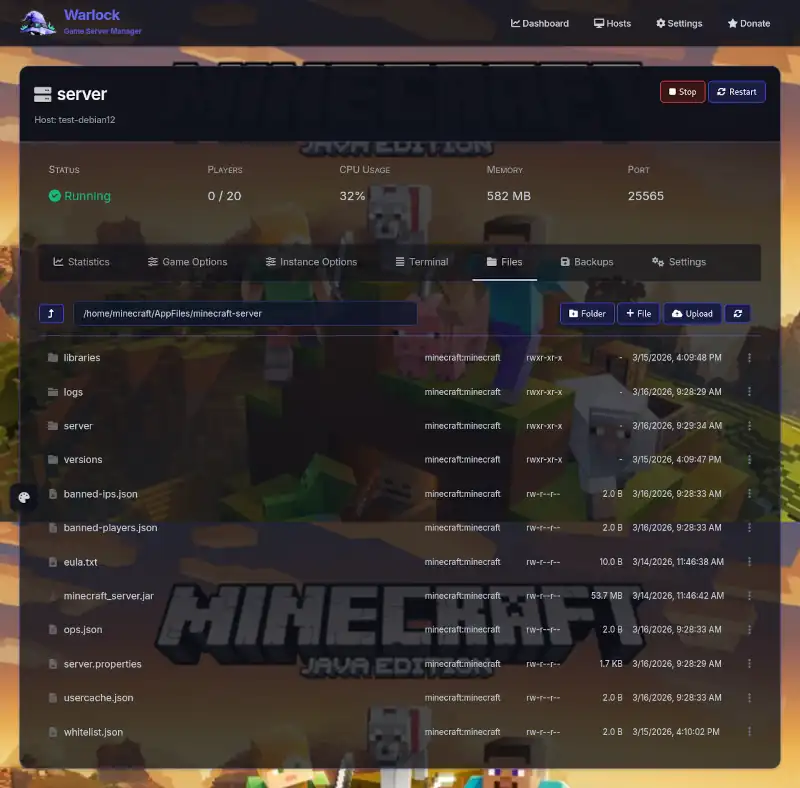
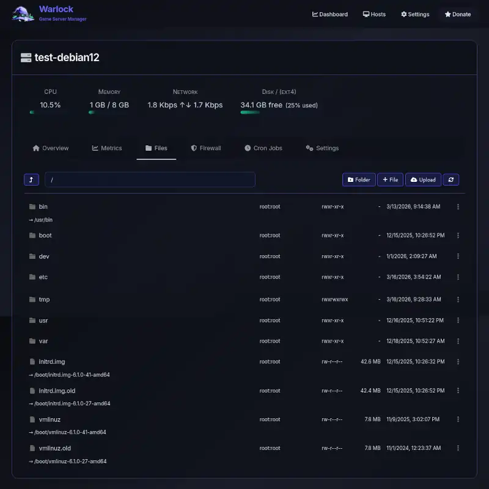
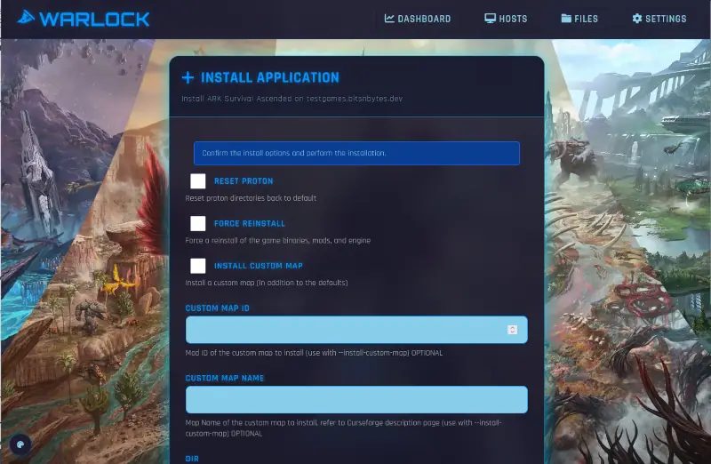

# Warlock Game Manager

Server game manager that supports your fleet of servers and games.

## Features

- Simple game installer
- Game configuration management
- Firewall and port management
- Backup and restore functionality
- User-friendly web interface



## Getting Started

To install Warlock on a server, do the following as root:

```bash
mkdir -p /var/www
chmod a+rx /var/www
cd /var/www
git clone https://github.com/BitsNBytes25/Warlock.git
cd Warlock
./install-warlock.sh
```

This will install Node and all required dependencies and set up Warlock to run as a service.

By default it will install nginx as a frontend, taking over the default web server.

You can skip the nginx integration by passing `--skip-nginx` to the install script.

## First Run

When you first install Warlock, you need to set up an admin user via the web interface.
Access your site by its IP or hostname you setup, (recommended to use a domain with SSL/TLS),
and you will be presented with an interface to create your first admin user.

Once created, you can create additional users and add server hosts to your cluster.

By default `localhost` is added as a server host, so you can start installing games right away
on the server on which you install Warlock.
You are free to remove that host from the management interface if you wish to only install games on remote servers.

## Server Hosts

Warlock is designed to manage multiple server hosts from a single interface,
allowing you to install games on whichever system you choose.




## Server Files

Warlock provides a basic file management interface for uploading, downloading, and editing configuration files.
This can be useful for various administration tasks.




## Installing Games

Supported games can be installed by selecting the desired game server
and selecting a compatible server host.



## Managing Games

Once installed, games and their instances will show on the dashboard,
along with links to start, stop, and configure them.


Some games, (like ARK Survival Ascended) install multiple map instances,
with each instance being configurable and manageable separately.


## Games Supported

* [ARK Survival Ascended](https://github.com/cdp1337/ARKSurvivalAscended-Linux)
* [Minecraft](https://github.com/BitsNBytes25/Minecraft-Installer)
* [Palworld](https://github.com/BitsNBytes25/Palworld-Installer)
* [Valheim](https://github.com/BitsNBytes25/Valheim-Installer)
* [VEIN](https://github.com/BitsNBytes25/VEIN-Dedicated-Server)

To add a new game, [check out the Template Repo](https://github.com/BitsNBytes25/Warlock-Game-Template)
for example code and instructions on getting started!

## Links and Contact

* [Volleyball coach-turned-developer Micah](https://micahtml.com/)
* [Bits n Bytes Community](https://bitsnbytes.dev)
* [Donate to this project](https://ko-fi.com/bitsandbytes)
* [Join our Discord](https://discord.gg/jyFsweECPb)
* [Follow us on Mastodon](https://social.bitsnbytes.dev/@sitenews)

## AI / LLM Disclaimer

Warlock was originally generated with various models including GPT-5 and Claude Sonnet 4.5
via Copilot's integration feature.

Then it was effectively rewritten because generated code is absolutely rubbish and horribly unmaintainable.

After wasting a week just un-fraking the generated code, now we just use those AI models to generate tiny snippets of code throughout this project.
