#  

Server game manager that supports your fleet of servers and games.

## Features

- Simple game installer
- Game configuration management
- Firewall and port management
- Backup and restore functionality
- User-friendly web interface

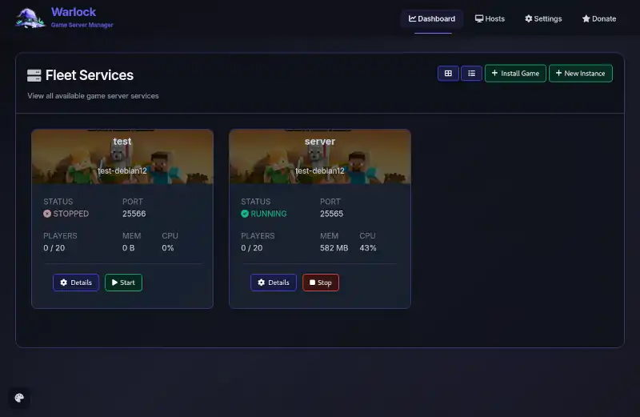


### Host and Service Metrics

Warlock provides historical metrics for each server host and service.

Hosts track CPU, memory, total disk space, and network traffic.

Services track CPU, memory consumption, player count, API response time, and service status.

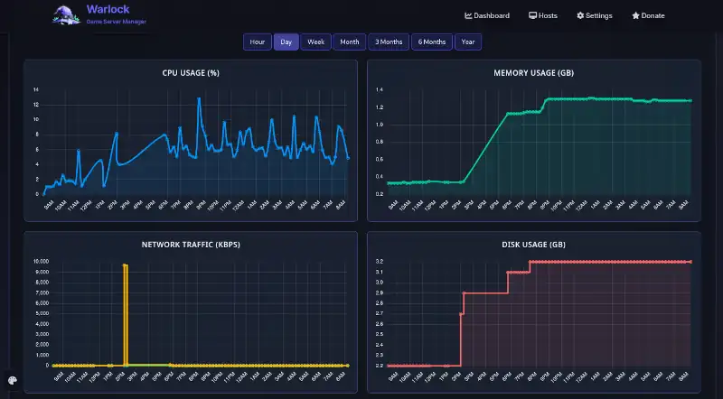


### Game Configuration Management

Warlock provides a simple interface for managing game configurations.
Changes are applied immediately and automtically update the necessary
raw configuration file on the server.

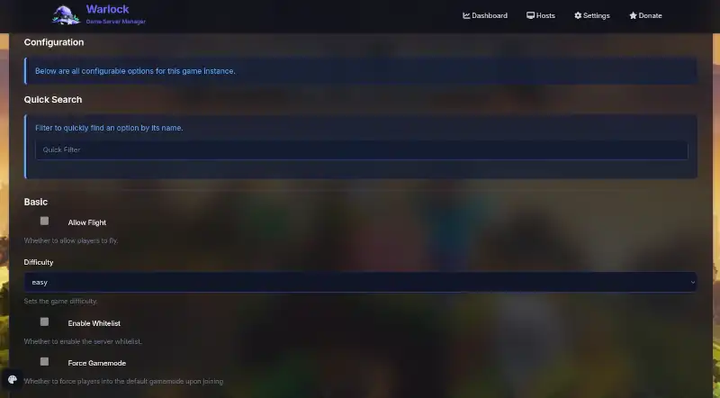


### Game Logs and Terminal

Logs over the past days and weeks are available for games,
and select games support running commands on the game server.

This includes command autocomplete based off the specific game.

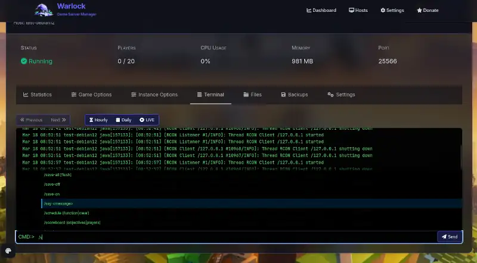


### Game and Host Files

Warlock provides a simple interface for managing game and host files.

* Uploading files
* Deleting files
* Editing text files
* Downloading files
* Extracting archives (zip, rar, tar, tgz, etc)

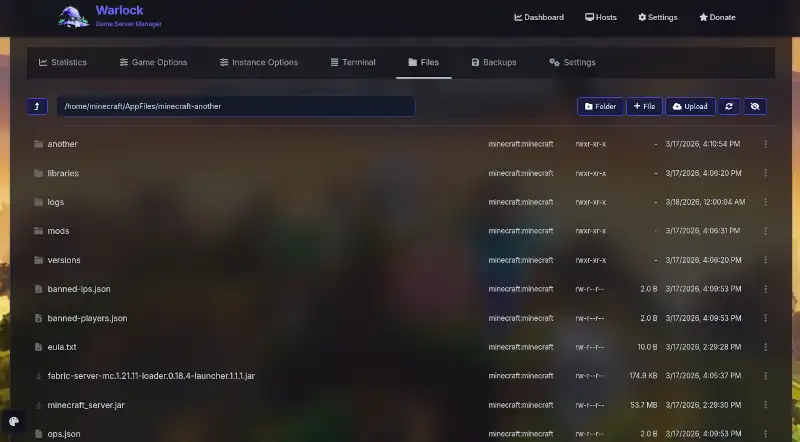


### Game Backups and Restoration

Backups for each game instance can be manually created or restored,
and backup jobs can be scheduled to run automatically.

_(Important note, backups are stored on the server host,
so for long term storage it is recommended to download important backups._)

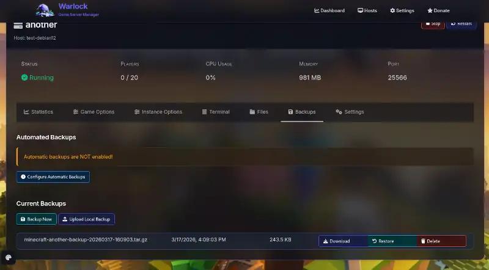


### Game Versions, Updates, and Restarts

Select games allow installing a specific version of the game.
Additionally, some games also support installing mod loaders directly from within Warlock.

Automatic updates and automatic restarts can also be scheduled
for each game instance.

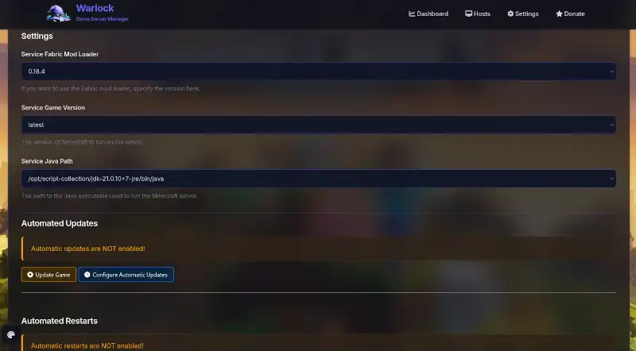

## Getting Started

### Development Build

To get a development build of Warlock up and running, do the following:

```bash
git clone https://github.com/BitsNBytes25/Warlock.git
cd Warlock
npm install
```

Then you can start the development server with:

```bash
npm run dev
```

During rapid development, the following will be useful.
This will skip database migration checks to allow faster restarting
of the development server.

```bash
npm run dev:quick
```

To profile commands and record a list of how long each takes
and which commands are cached:

```bash
npm run dev:profile
```

### Production Install

The recommended method for installing on production servers
is to use the provided bootstrap script.

This script will install git, checkout the application in `/var/www/warlock`,
and run the install script to complete the process.

The default installation will use nginx as a proxy,
install a service into systemd to manage Warlock,
and install the appropriate version of Node.js to run the application.

Before installing on a production server,
it is recommended to have a domain name (or subdomain)
pointed to the server's IP address via an `A` or `CNAME` record.
This will enable an SSL certificate to be auto-generated with certbot for Warlock.

#### Debian

Debian does not ship with `sudo` by default, so use `su` instead.
This requires the **root** password to be entered if ran as a non-root user.

```bash
su - -c "bash <(wget -qO- https://raw.githubusercontent.com/BitsNBytes25/Warlock/main/bootstrap.sh)" root
```

#### Ubuntu

Ubuntu and other derivatives ship with `sudo` by default, so you can use the following command to install Warlock.
If prompted for a password, enter your user password.

```bash
sudo su - -c "bash <(wget -qO- https://raw.githubusercontent.com/BitsNBytes25/Warlock/main/bootstrap.sh)" root
```


### Production Build (Manual Process)

To install Warlock on a server, do the following as root:

```bash
# Debian/Ubuntu
apt install git
# Fedora/RHEL
dnf install git
# Arch Linux
pacman -S git

mkdir -p /var/www
chmod a+rx /var/www
cd /var/www
git clone https://github.com/BitsNBytes25/Warlock.git
cd Warlock
./install-warlock.sh
```

This will install Node and all required dependencies and set up Warlock to run as a service.

By default it will install nginx as a frontend, taking over the default web server.

You can skip the nginx integration by passing `--skip-nginx` to the install script.

You can also skip systemd integration by passing `--skip-systemd`.

### Docker Build

Warlock can be run as a Docker container, but an nginx reverse proxy is recommended to handle SSL termination.

```bash
docker pull bitsnbytes25/warlock:latest
docker run \
  --name warlock \
  -p 3077:3077 \
  -v warlock_data:/app/data \
  -v warlock_ssh:/home/warlock/.ssh \
  bitsnbytes25/warlock:latest
```


## Supported Platforms

Warlock supports any Linux distribution, but at the moment most games expect
Ubuntu or Debian.

Since Warlock does not _need_ to be on the same server as your game hosts,
you are free to run Warlock on an Arch server (for example)
and have Debian / Ubuntu game hosts in the cluster.

You can run Warlock on your laptop or other local device, providing
your device has SSH access to the server you wish to manage.
This is an excellent option as it keeps the management interface local.

## First Run

When you first install Warlock, you need to set up an admin user via the web interface.
Access your site by its IP or hostname you setup, (recommended to use a domain with SSL/TLS),
and you will be presented with an interface to create your first admin user.

Once created, you can create additional users and add server hosts to your cluster.

By default `localhost` is added as a server host, so you can start installing games right away
on the server on which you install Warlock.
You are free to remove that host from the management interface if you wish to only install games on remote servers.

(_Docker installs will NOT configure localhost as a server host._)

## Server Hosts

Warlock is designed to manage multiple server hosts from a single interface,
allowing you to install games on whichever system you choose.

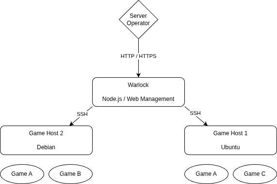

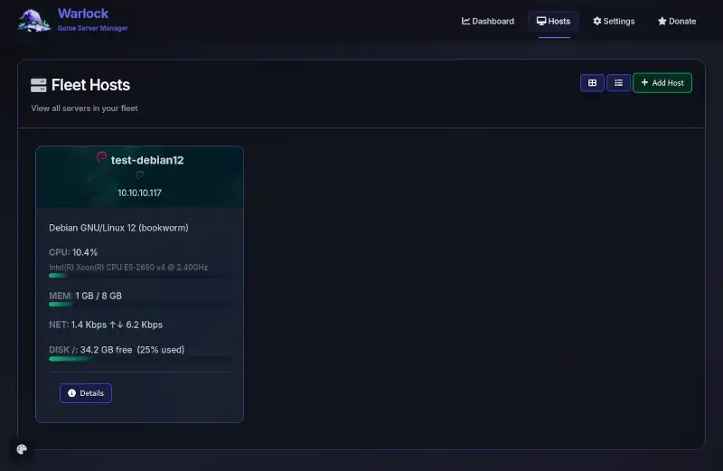

To add a new server host, you will need to enter its IP address
and ensure it can be reached via SSH from the Warlock server.

Connection from the web management server and game hosts is performed via SSH,
and you will be presented with a command to run on your game host to authorize
the Warlock server to connect.


## Server Files

Warlock provides a basic file management interface for uploading, downloading, and editing configuration files.
This can be useful for various administration tasks.

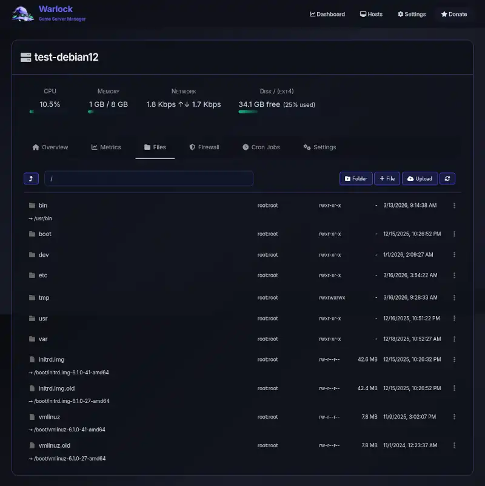

## Installing Games

Supported games can be installed by selecting the desired game server
and selecting a compatible server host.

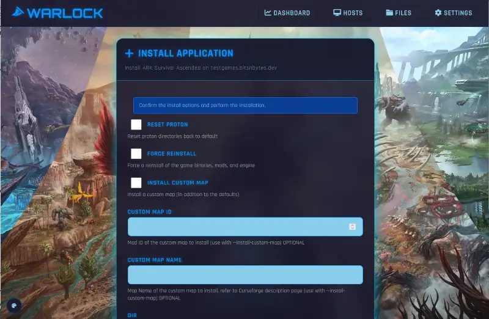

## Managing Games

Once installed, games and their instances will show on the dashboard,
along with links to start, stop, and configure them.


Some games, (like ARK Survival Ascended) install multiple map instances,
with each instance being configurable and manageable separately.


## Games Supported

* [ARK Survival Ascended](https://github.com/cdp1337/ARKSurvivalAscended-Linux)
* [Hytale](https://github.com/BitsNBytes25/Hytale-Installer)
* [Minecraft](https://github.com/BitsNBytes25/Minecraft-Installer)
* [Palworld](https://github.com/BitsNBytes25/Palworld-Installer)
* [Project Zomboid](https://github.com/BitsNBytes25/Zomboid-Installer)
* [Valheim](https://github.com/BitsNBytes25/Valheim-Installer)
* [VEIN](https://github.com/BitsNBytes25/VEIN-Dedicated-Server)

To add a new game, [check out the Template Repo](https://github.com/BitsNBytes25/Warlock-Game-Template)
for example code and instructions on getting started!

## Updating Warlock

To update Warlock, connect to your server via SSH and run:

```bash
sudo /var/www/Warlock/update-warlock.sh
```

Additionally, the bootstrap can be ran again which will detect an existing installation
and call update automatically.

This should prompt with available branches, continuing through will default will use the current branch.

```
Fetching remote branch information...
remote: Enumerating objects: 3, done.
remote: Counting objects: 100% (3/3), done.
remote: Total 3 (delta 2), reused 3 (delta 2), pack-reused 0 (from 0)
Unpacking objects: 100% (3/3), 544 bytes | 544.00 KiB/s, done.
From https://github.com/BitsNBytes25/Warlock
   8b9c069..b9e5c0c  main       -> origin/main

Available remote branches:

  [1] * main (2026-03-16) b9e5c0c [CURRENT]
  [2] release-v1.2 (2026-03-15) 75a41dc
  [3] release-v1.0 (2026-01-16) 93b34a1

  [0] Cancel

Select branch number to switch/upgrade (default: main): 
Using current branch: main
Checking for updates on current branch...
From https://github.com/BitsNBytes25/Warlock
 * branch            main       -> FETCH_HEAD
Stopping Warlock service...
Pulling latest changes...
From https://github.com/BitsNBytes25/Warlock
 * branch            main       -> FETCH_HEAD
Updating 8b9c069..b9e5c0c
Fast-forward
 install-warlock.sh | 3 +++
 1 file changed, 3 insertions(+)
Successfully updated to branch: main
Running installer to apply any necessary updates...
```

The updater will handle switching branches (if requested) and running the installer in update mode
to complete the upgrade process.

## Links and Contact

* [Volleyball coach-turned-developer Micah](https://micahtml.com/)
* [Bits n Bytes Community](https://bitsnbytes.dev)
* [Donate to this project](https://ko-fi.com/bitsandbytes)
* [Join our Discord](https://discord.gg/jyFsweECPb)
* [Follow us on Mastodon](https://social.bitsnbytes.dev/@sitenews)


## Analytics Collection

To help improve Warlock, we collect some anonymous analytics data.

This includes:

* Version of Warlock installed
* Server OS and version
* Games installed
* Approximate geolocation of server, (country and approximate area).

## AI / LLM Disclaimer

Warlock was originally generated with various models including GPT-5 and Claude Sonnet 4.5
via Copilot's integration feature.

Then it was effectively rewritten because generated code is absolutely rubbish and horribly unmaintainable.

After wasting a week just un-fraking the generated code, now we just use those AI models to generate tiny snippets of code throughout this project.
